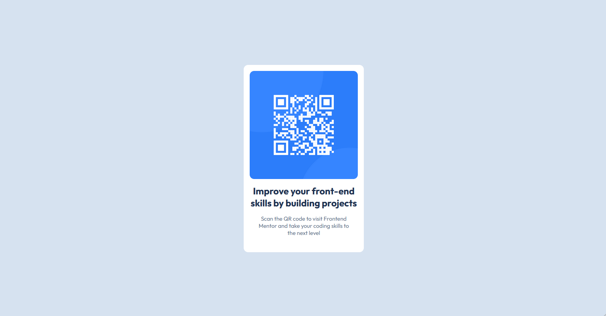

# Frontend Mentor - QR code component solution

This is a solution to the [QR code component challenge on Frontend Mentor](https://www.frontendmentor.io/challenges/qr-code-component-iux_sIO_H). Frontend Mentor challenges help you improve your coding skills by building realistic projects. 

## Table of contents

- [Overview](#overview)
  - [Screenshot](#screenshot)
  - [Links](#links)
- [My process](#my-process)
  - [Built with](#built-with)
  - [What I learned](#what-i-learned)
  - [Continued development](#continued-development)
- [Author](#author)
- [Acknowledgments](#acknowledgments)

**Note: Delete this note and update the table of contents based on what sections you keep.**

## Overview

### Screenshot

### Links

## Links

- Solution URL: [https://www.frontendmentor.io/solutions/qr-code-component-1XMhqClXwP](https://www.frontendmentor.io/solutions/qr-code-component-1XMhqClXwP)
- Live Site URL: [https://qr-card-component-five.vercel.app](https://qr-card-component-five.vercel.app)

## My process

### Built with

- Semantic HTML5 markup
- CSS
- Flexbox

### What I learned

How to read a Figma file.

### Continued development

I definitely need to do more of these challenges as well as get more practices coding from an established
design. Learning Figma would be very beneficial.

## Author

- Frontend Mentor - [@JNW365](https://www.frontendmentor.io/profile/JNW365)

